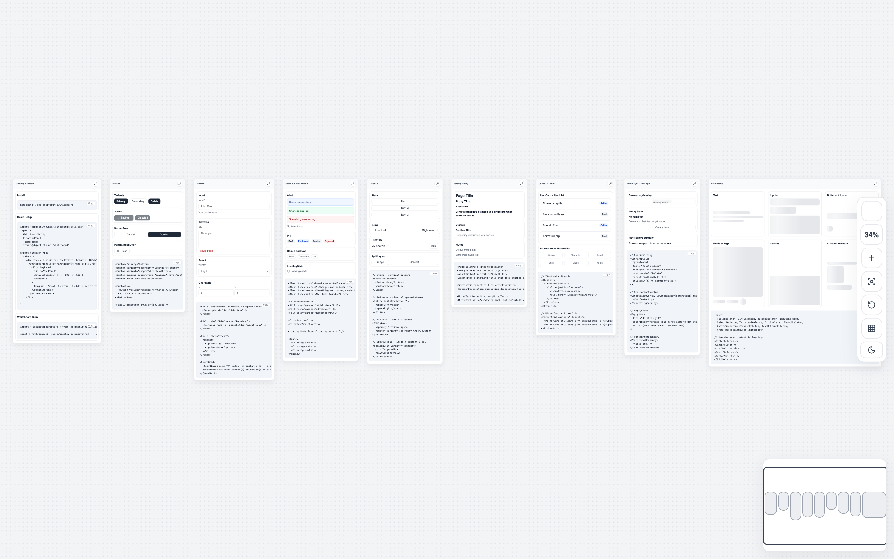
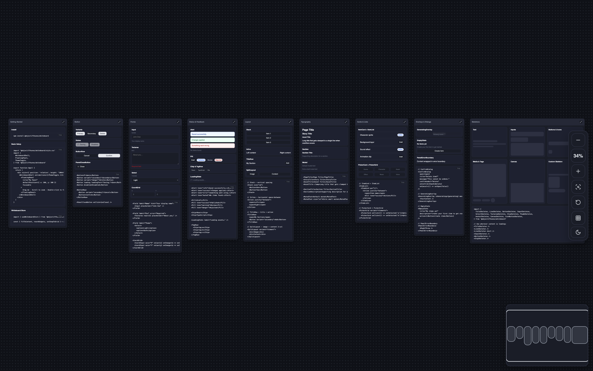
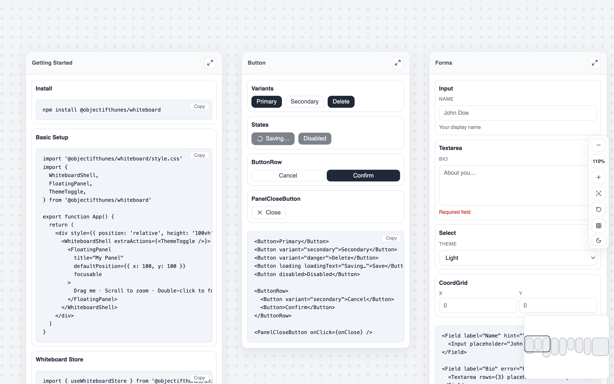

# @objectifthunes/whiteboard

A pan/zoom whiteboard canvas for React with draggable floating panels, a minimap, snap-to-grid, and a complete set of UI primitives — all themed via CSS custom properties.

<p align="center">
  
  
</p>
<p align="center">
  
</p>

## Features

- **Pan & zoom canvas** — drag to pan, scroll to zoom, pointer-capture safe
- **Floating panels** — drag to reposition, double-click to focus, snap to grid
- **Minimap** — live overview with clickable navigation
- **ZoomBar** — zoom in/out, fit to content, reset, snap toggle
- **Zustand store** — full programmatic control (`fitToContent`, `focusPanel`, `resetWidgets`, …)
- **40+ UI components** — buttons, forms, alerts, typography, skeletons, dialogs, and more
- **Light / dark theme** — CSS custom properties, switchable with `<ThemeToggle />`

## Install

```bash
npm install @objectifthunes/whiteboard
# peer deps
npm install react react-dom zustand
```

## Quick Start

```tsx
import '@objectifthunes/whiteboard/style.css'
import {
  WhiteboardShell,
  FloatingPanel,
  ThemeToggle,
} from '@objectifthunes/whiteboard'

export function App() {
  return (
    <div style={{ position: 'relative', height: '100vh' }}>
      <WhiteboardShell extraActions={<ThemeToggle />}>
        <FloatingPanel
          title="My Panel"
          defaultPosition={{ x: 100, y: 100 }}
          focusable
        >
          Drag me · Scroll to zoom · Double-click to focus
        </FloatingPanel>
      </WhiteboardShell>
    </div>
  )
}
```

## Whiteboard Components

### `<WhiteboardShell>`

The root container. Handles pan, zoom, viewport tracking, and auto-fit.

```tsx
<WhiteboardShell
  showMinimap={true}          // default: true
  minimapLoading={false}      // show spinner in minimap
  extraActions={<ThemeToggle />}  // rendered inside the ZoomBar
>
  {/* FloatingPanels go here */}
</WhiteboardShell>
```

### `<FloatingPanel>`

A draggable card placed on the canvas.

```tsx
<FloatingPanel
  title="Settings"
  defaultPosition={{ x: 100, y: 80 }}
  width={320}                   // default: 300
  focusable                     // shows focus button in header
  focusPadding={40}             // padding when focusing (default: 40)
  focusMaxScale={1.5}           // max zoom when focusing (default: 1.5)
  headerActions={<Button>…</Button>}
  trackRect={rectRef}           // keep a MutableRefObject in sync
>
  {/* any content */}
</FloatingPanel>
```

Double-click the panel or press the focus button to zoom the whiteboard to that panel.

### `useWhiteboardStore`

Full programmatic access to the whiteboard state.

```ts
import { useWhiteboardStore } from '@objectifthunes/whiteboard'

const fitToContent   = useWhiteboardStore(s => s.fitToContent)
const resetWidgets   = useWhiteboardStore(s => s.resetWidgets)
const setSnapToGrid  = useWhiteboardStore(s => s.setSnapToGrid)
const scale          = useWhiteboardStore(s => s.scale)
const offset         = useWhiteboardStore(s => s.offset)
```

### `useWhiteboardLayout`

Compute grid-snapped panel positions from a map of widths.

```tsx
const { positions, panelWidth } = useWhiteboardLayout({
  widths: { settings: 320, preview: 480, layers: 280 },
  startX: 40,
  y: 60,
  gap: 20,
})

// positions.settings → { x: 40, y: 60 }
// positions.preview  → { x: 380, y: 60 }
// positions.layers   → { x: 880, y: 60 }
```

### Helpers

```ts
import {
  computeWhiteboardFit,       // compute scale/offset to fit all panels
  computeWhiteboardRectFocus, // compute scale/offset to focus a rect
  snapToWhiteboardGrid,       // snap value to nearest grid multiple
  WHITEBOARD_GRID,            // grid size constant (20)
  usePanelRect,               // create a MutableRefObject<PanelRect>
  belowPanel,                 // get position just below a tracked panel
} from '@objectifthunes/whiteboard'
```

---

## UI Components

### Buttons

```tsx
<Button>Primary</Button>
<Button variant="secondary">Secondary</Button>
<Button variant="danger">Delete</Button>
<Button loading loadingText="Saving…">Save</Button>
<Button disabled iconOnly><TrashIcon /></Button>

<ButtonRow>
  <Button variant="secondary">Cancel</Button>
  <Button>Confirm</Button>
</ButtonRow>

<PanelCloseButton onClick={onClose} />
```

### Forms

```tsx
<Field label="Name" hint="Display name" error="Required">
  <Input placeholder="John Doe" />
</Field>

<Field label="Bio">
  <Textarea rows={4} placeholder="About you…" />
</Field>

<Field label="Theme">
  <Select>
    <option>Light</option>
    <option>Dark</option>
  </Select>
</Field>

// Coordinate inputs (x, y, z, scale)
<CoordGrid>
  <CoordInput axis="X" value={x} onChange={e => setX(+e.target.value)} />
  <CoordInput axis="Y" value={y} onChange={e => setY(+e.target.value)} />
</CoordGrid>
```

### Status & Feedback

```tsx
<Alert tone="info">Everything looks good.</Alert>
<Alert tone="success">Saved.</Alert>
<Alert tone="error">Something went wrong.</Alert>
<Alert tone="muted">No results.</Alert>

<Pill>Draft</Pill>
<Pill tone="success">Published</Pill>
<Pill tone="warning">Review</Pill>
<Pill tone="danger">Rejected</Pill>

<Chip>React</Chip>

<TagRow>
  <Chip>tag-1</Chip>
  <Chip>tag-2</Chip>
</TagRow>

<LoadingState label="Fetching…" />
```

### Overlays

```tsx
// Confirmation dialog (portal)
<ConfirmDialog
  open={open}
  title="Delete scene?"
  message="This cannot be undone."
  confirmLabel="Delete"
  onConfirm={handleDelete}
  onCancel={() => setOpen(false)}
/>

// Overlay a loading state over content
<GeneratingOverlay isGenerating={generating} message="Building…">
  <YourContent />
</GeneratingOverlay>

// Empty state placeholder
<EmptyState
  title="No items yet"
  description="Create your first item to get started."
  action={<Button>Create item</Button>}
/>

// Catch errors inside a panel
<PanelErrorBoundary>
  <PotentiallyBrokenWidget />
</PanelErrorBoundary>
```

### Layout

```tsx
<Stack size="sm">          {/* vertical spacing: sm | md */}
<Inline justify="between"> {/* horizontal: start | between */}
<TitleRow>                 {/* space-between row for title + action */}
<SplitLayout variant="element">  {/* 2-col image+content grid */}
```

### Cards & Lists

```tsx
<ItemList>
  <ItemCard as="li">
    <Inline justify="between">
      <span>Character sprite</span>
      <Pill tone="success">Active</Pill>
    </Inline>
  </ItemCard>
</ItemList>

<PickerGrid variant="elements">   {/* elements | characters | library */}
  <PickerCard onClick={() => select('a')}>Option A</PickerCard>
</PickerGrid>
```

### Selections

```tsx
<ChoiceGroup
  options={[
    { value: 'left',  label: 'Left to right' },
    { value: 'right', label: 'Right to left', description: 'Arabic, Hebrew' },
  ]}
  value={direction}
  onChange={setDirection}
/>
```

### Typography

```tsx
<PageTitle>Page Title</PageTitle>
<StoryTitle>Story Title</StoryTitle>
<AssetTitle clamp>Long name…</AssetTitle>
<SectionTitle>Section</SectionTitle>
<SectionDescription>Supporting copy.</SectionDescription>
<MutedText size="xs">Hint text</MutedText>
```

### Skeletons

```tsx
import {
  TitleSkeleton, LineSkeleton, ButtonSkeleton, IconButtonSkeleton,
  InputSkeleton, SelectSkeleton, TextareaSkeleton, ChipSkeleton,
  ThumbSkeleton, AvatarSkeleton, CanvasSkeleton,
  Skeleton,             // base — use radius="sm" | "md" | "pill"
} from '@objectifthunes/whiteboard'

// Custom skeleton
<Skeleton style={{ width: 120, height: 16 }} />
<Skeleton radius="md" style={{ width: 80, height: 80 }} />
```

### Panel Sections

```tsx
<PanelSection
  heading="Assets"
  description="Drag an asset onto the canvas."
  actions={<Button variant="secondary">Upload</Button>}
>
  {/* panel body */}
</PanelSection>

<PanelTitle icon={<LayersIcon size={14} />} label="Layers" />
```

---

## CSS Import

The package ships a single stylesheet. Import it once at the root:

```tsx
import '@objectifthunes/whiteboard/style.css'
```

Theming uses CSS custom properties on `[data-theme]`. The built-in `<ThemeToggle />` toggles `data-theme="dark"` on `<html>`.

---

## License

MIT © ObjectifThunes
